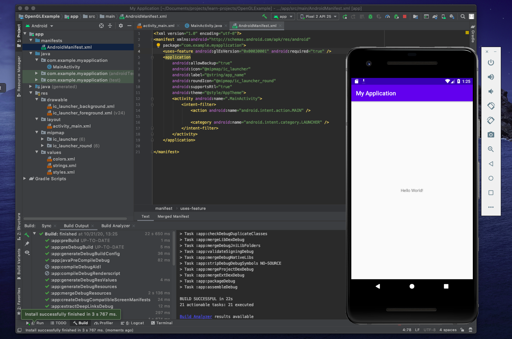
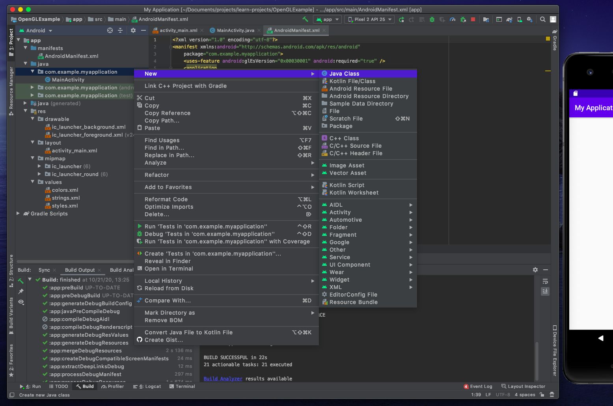

> Bài viết lấy resources từ https://developer.android.com/guide/topics/graphics/opengl

# Andorid Studio

Tải về [ở đây](https://developer.android.com/studio), và cài đặt như phần mềm bình thường

### Cài SDK

Trong màn hình **Welcome to Android Studio** chọn **configure** góc dưới phải -> **SDK Manager**

Ở mục Android SDK chọn `Android 7.1.1` với `API 25`, vừa đủ mới và đủ cũ để làm trong năm 2020 :>

> OpenGL ES 1.0 and 1.1 - This API specification is supported by Android 1.0 and higher.
>
> OpenGL ES 2.0 - This API specification is supported by Android 2.2 (API level 8) and higher.
>
> OpenGL ES 3.0 - This API specification is supported by Android 4.3 (API level 18) and higher.
>
> OpenGL ES 3.1 - This API specification is supported by Android 5.0 (API level 21) and higher.

Chuyển sang tab **SDK Tools** bên trên phải chọn **NDK**, **CMake** (những thứ này để build OpenGL ES)


Apply -> Cài -> OK

### Android Emulator

Ở màn hình **Welcome**, **configure** -> **AVD Manager** -> **Create Virtual Device** -> Chọn đồ chơi tuỳ ý :> -> trỏ tới **Android 7.1**, Download nếu chưa có.

# Ví dụ tam giác OpenGL ES

Chỉ vẽ tam giác trong OpenGl ES :>

### Tạo Project

Ở màn hình **Welcome** chọn **Start new Android Studio Project** -> chọn **Empty Activity** -> Chọn location, name,... rồi **finish**


### Một số khái niệm

Code Android thì dùng Java mà Java thì theo lý trí Opp chỉ có class.

Activity: có thể một class Activity trong file `MainActivity.java`, một activity = một màn hình

[App manifest](https://developer.android.com/guide/topics/manifest/manifest-intro) là nơi chứa thông tin app để show cho **Android build tools**, **Android OS** và **Google Play**

### Đưa OpenGL ES vào

Chỉ cần vào `AndroidManifest.xml` thêm vào (trong tag manifest, trên tag application):

```xml
<!-- Tell the system this app requires OpenGL ES 2.0. -->
<uses-feature android:glEsVersion="0x00020000" android:required="true" />
```

Xong build (cái búa) và chạy (nút play), được như vầy không lỗi là OK



### Tạo các class chính trong OpenQL ES (View, Renderer)

- Cách tạo class

Như vầy nhé =))



- Class View

```java
import android.content.Context;
import android.opengl.GLSurfaceView;

class MyGLSurfaceView extends GLSurfaceView {

    private final MyGLRenderer renderer;

    public MyGLSurfaceView(Context context){
        super(context);

        // Create an OpenGL ES 2.0 context
        setEGLContextClientVersion(2);

        renderer = new MyGLRenderer();

        // Set the Renderer for drawing on the GLSurfaceView
        setRenderer(renderer);
    }
}
```

Class **MyGLSurfaceView** để hiện màn hình (view) OpenGL lên màn hình Android, class này được kế thừa từ class **GLSurfaceView** của **OpenGLES**

[setEGLContextClientVersion(2)](<https://developer.android.com/reference/android/opengl/GLSurfaceView#setEGLContextClientVersion(int)>) để tạo một [OpenGL context](https://www.khronos.org/opengl/wiki/OpenGL_Context) thích hợp với OpenGL2.0, sau đó phải `setRenderer` từ một class kế thừa class **GLSurfaceView.Renderer**

- Class Renderer

```java
import javax.microedition.khronos.egl.EGLConfig;
import javax.microedition.khronos.opengles.GL10;

import android.opengl.GLES20;
import android.opengl.GLSurfaceView;

public class MyGLRenderer implements GLSurfaceView.Renderer {

    public void onSurfaceCreated(GL10 unused, EGLConfig config) {
        // Set the background frame color
        GLES20.glClearColor(0.0f, 0.0f, 0.0f, 1.0f);
    }

    public void onDrawFrame(GL10 unused) {
        // Redraw background color
        GLES20.glClear(GLES20.GL_COLOR_BUFFER_BIT);
    }

    public void onSurfaceChanged(GL10 unused, int width, int height) {
        GLES20.glViewport(0, 0, width, height);
    }
}
```

Cần vẽ gì trong khung View, shape như thế nào? Khai báo trong class **Renderer**

`onSurfaceCreated` chạy lúc render lần đầu, dùng để khai báo các giá trị màu, độ sâu,... clear lại màn hình cho lần vẽ tiếp theo, ở đây ta khai báo màu đen (rgba = 0,0,0,0) là màu background để clear màn hình mỗi lần vẽ

`onDrawFrame` sẽ chạy lúc OpenGL vẽ (sau `onSurfaceCreated`), ta muốn vẽ gì sẽ làm trong này. Chạy `glClear` để clear màn hình và tô màu có giá trị khai báo trên `RendereronSurfaceCreated` (màu đen)

`onSurfaceChanged` sẽ chạy khi màn hình thay đổi (điện thoại để ngang dọc, wake from sleep), `glViewport(0, 0, width, height)` sẽ set nguyên màn hình là view của OpenGl, từ tọa độ (0,0) và độ dài là width, height

- Thêm View vào Activity

View là một khung, Activity là cả màn hình, file **MainActivity.java** là file chứa class của màn hình chính của **app**

```java
public class MainActivity extends AppCompatActivity {
    private GLSurfaceView gLView;

    @Override
    public void onCreate(Bundle savedInstanceState) {
        super.onCreate(savedInstanceState);

        // Create a GLSurfaceView instance and set it
        // as the ContentView for this Activity.
        gLView = new OpenGLView(this);
        setContentView(gLView);
    }

}
```

`onCreate` chạy khi mới vào **app**, ta tạo một **OpenGLView** và set nguyên màn hình có content là **OpenGLView** bằng `setContentView`

Tới đây chạy lại app, nếu không lỗi màn hình đen thui là OK do chưa vẽ gì :v

- Một số thắc mắc

`extends` là tạo một class con kế thừa từ một class

`implements` là định nghĩa hàm, biến của một class

Lúc thì xài `GL10`, lúc `GLES20`? Vì version mới sẽ dựa vào những syntax cũ để những codebase khi upgrade lên sẽ không bị lỗi nên nó giữ `GL10` như là **core** syntax, code trong bài là OpenGL2.0, [2.0 vs 3.0](https://stackoverflow.com/questions/17543364/what-are-the-differences-between-opengl-es-2-0-and-opengl-es-3-0)

### Vẽ tam giác <|

Trước khi code thì nhớ 2 điều

> Vertex Shader: Position and Custom data.
>
> Fragment Shader: RGB color.

- Định nghĩa shape của tam giác

```java
public class Triangle {

    private FloatBuffer vertexBuffer;

    // number of coordinates per vertex in this array
    static final int COORDS_PER_VERTEX = 3;
    static float triangleCoords[] = {   // in counterclockwise order:
             0.0f,  0.622008459f, 0.0f, // top
            -0.5f, -0.311004243f, 0.0f, // bottom left
             0.5f, -0.311004243f, 0.0f  // bottom right
    };

    // Set color with red, green, blue and alpha (opacity) values
    float color[] = { 0.63671875f, 0.76953125f, 0.22265625f, 1.0f };

    public Triangle() {
        // initialize vertex byte buffer for shape coordinates
        ByteBuffer bb = ByteBuffer.allocateDirect(
                // (number of coordinate values * 4 bytes per float)
                triangleCoords.length * 4);
        // use the device hardware's native byte order
        bb.order(ByteOrder.nativeOrder());

        // create a floating point buffer from the ByteBuffer
        vertexBuffer = bb.asFloatBuffer();
        // add the coordinates to the FloatBuffer
        vertexBuffer.put(triangleCoords);
        // set the buffer to read the first coordinate
        vertexBuffer.position(0);
    }
}
```

Định nghĩa tọa độ (vertex) đưa vào ByteBuffer, biến `color` để cho hàm vẽ, một tọa độ là **x, y, z**, y = `0.5f` nghĩa là nửa trên màn hình (f = frame)

- Draw tam giác

Đầu tiên ta cần định nghĩa:

> Vertex Shader - OpenGL ES graphics code for rendering the vertices of a shape. (tọa độ)
>
> Fragment Shader - OpenGL ES code for rendering the face of a shape with colors or textures. (màu)
>
> Program - An OpenGL ES object that contains the shaders you want to use for drawing one or more shapes.

Những **Shaders** này chứa code **OpenGL Shading Language (GLSL)**, ta phải compiled những đoạn GLSL này và gắn nó vào **Program**

_Khai báo vertex và fragment GLSL trong class Triangle_

```java
public class Triangle {

    private final String vertexShaderCode =
        "attribute vec4 vPosition;" +
        "void main() {" +
        "  gl_Position = vPosition;" +
        "}";

    private final String fragmentShaderCode =
        "precision mediump float;" +
        "uniform vec4 vColor;" +
        "void main() {" +
        "  gl_FragColor = vColor;" +
        "}";

    ...
}
```

_Tạo hàm compile GLSL trong class Renderer_

```java
public static int loadShader(int type, String shaderCode){

    // create a vertex shader type (GLES20.GL_VERTEX_SHADER)
    // or a fragment shader type (GLES20.GL_FRAGMENT_SHADER)
    int shader = GLES20.glCreateShader(type);

    // add the source code to the shader and compile it
    GLES20.glShaderSource(shader, shaderCode);
    GLES20.glCompileShader(shader);

    return shader;
}
```

_Tạo OpenGL ES Program để vẽ và gắn compiled vertex và fragment GLSL vào program (trong constructor của class Triangle)_

```java
public class Triangle() {
    ...

    private final int mProgram;

    public Triangle() {
        ...

        int vertexShader = MyGLRenderer.loadShader(GLES20.GL_VERTEX_SHADER,
                                        vertexShaderCode);
        int fragmentShader = MyGLRenderer.loadShader(GLES20.GL_FRAGMENT_SHADER,
                                        fragmentShaderCode);

        // create empty OpenGL ES Program
        mProgram = GLES20.glCreateProgram();

        // add the vertex shader to program
        GLES20.glAttachShader(mProgram, vertexShader);

        // add the fragment shader to program
        GLES20.glAttachShader(mProgram, fragmentShader);

        // creates OpenGL ES program executables
        GLES20.glLinkProgram(mProgram);
    }
}
```

Sau đó tạo hàm `draw()`, cơ bản hàm này ta:

Lấy `handle to vertex` và `handle to fragment` -> _enable_ `handle to vertext` -> add data vào các `handle` (data tọa độ: `vertexBuffer` cho `handle to vertext`, data màu: `color` cho `handle to fragment`) -> vẽ -> _disable_ `handle to vertext`

```java
private int positionHandle;
private int colorHandle;

private final int vertexCount = triangleCoords.length / COORDS_PER_VERTEX;
private final int vertexStride = COORDS_PER_VERTEX * 4; // 4 bytes per vertex

public void draw() {
    // Add program to OpenGL ES environment
    GLES20.glUseProgram(mProgram);

    // get handle to vertex shader's vPosition member
    positionHandle = GLES20.glGetAttribLocation(mProgram, "vPosition");

    // Enable a handle to the triangle vertices
    GLES20.glEnableVertexAttribArray(positionHandle);

    // Prepare the triangle coordinate data
    GLES20.glVertexAttribPointer(positionHandle, COORDS_PER_VERTEX,
                                 GLES20.GL_FLOAT, false,
                                 vertexStride, vertexBuffer);

    // get handle to fragment shader's vColor member
    colorHandle = GLES20.glGetUniformLocation(mProgram, "vColor");

    // Set color for drawing the triangle
    GLES20.glUniform4fv(colorHandle, 1, color, 0);

    // Draw the triangle
    GLES20.glDrawArrays(GLES20.GL_TRIANGLES, 0, vertexCount);

    // Disable vertex array
    GLES20.glDisableVertexAttribArray(positionHandle);
}
```

### [Example source code](https://github.com/mtosity/OpenGLESTry)
