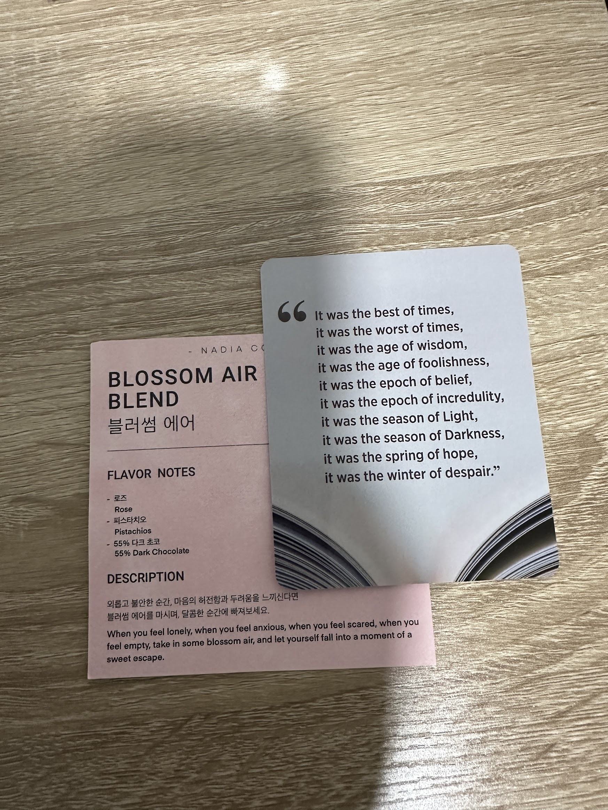

Decoding Happiness: Strategies to Cultivate Joy and Fulfillment in Everyday Life

## The Misconceptions about Happiness

Many of us chase after what we believe will make us happy: a promotion, a new car, or even a slimmer figure. Yet, time and again, these sources of happiness prove to be fleeting. Our culture bombards us with the message that more is better—more money, more possessions, more accolades. But the reality often falls short of our expectations.

For instance, consider the initial thrill of purchasing a new car. For the first few weeks, the smooth ride and shiny exterior bring joy. However, this excitement typically wanes as the car becomes just another part of daily life, its special status diminished by familiarity and the next model already being advertised.

Similarly, achieving a perfect body through rigorous dieting or even plastic surgery can lead to initial euphoria. Yet, this too can dissipate as new imperfections catch our eye or as we realize that our self-esteem issues still linger despite physical changes.

## Brain's Annoying Features

Our brains are equipped with mechanisms that often misguide us:

* *Faulty Intuitions:* Many believe that a higher salary or a prestigious job will bring lasting happiness. However, studies show that after basic needs are met, additional income does little to improve our well-being.

* *Misforecasting:* We often overestimate how much happiness new acquisitions will bring. For example, getting a dream job might seem like it will make us forever happy, but the daily grind can quickly overshadow initial excitement.

* *Relativity and Comparison:* We judge our lives not on their own merits but against those of others. If a friend receives a promotion or buys an expensive house, we might feel inadequate or less successful, even if our circumstances are objectively good.
* *Adaptation:* This feature of our brain causes us to quickly get used to changes. The happiness from a raise or a new relationship fades as they become the new norm. The same goes for negative events; people often adapt to difficulties more quickly than they expect.

## Strategies to Enhance Happiness

To find true, lasting happiness, consider the following strategies, complete with practical examples for everyday practice:

1. Rethink 'Awesome Stuff': Instead of buying the latest gadget or upgrading your car, invest in experiences like travel, learning a new skill, or attending cultural events. Experiences become part of our identity and enrich our lives in ways that material goods cannot.

2. Thwart Your Adaptation: Practice savoring small, everyday joys—like the taste of a good meal or the feeling of the sun on your face. Negative visualization, such as imagining life without some of the things you take for granted, can also renew your appreciation for them.

3. Reset Your Reference Points: Instead of comparing yourself to those who have more, consider how much you've progressed from your past, or how you might be envied by others. This can shift your perspective and foster gratitude.

4. Interrupt Consumption: Extend the life of your pleasures by breaking them up. Instead of binge-watching a TV series, watch an episode a night. This prolongs enjoyment and anticipation.

5. Leverage Your Strengths: Identify what you're good at and find ways to incorporate these skills into your daily activities, whether it's problem-solving at work or creativity in hobbies.

6. Adopt a Growth Mindset: Focus on the intrinsic value of activities. For example, study a subject not just to pass an exam but to truly understand the material and how it can be applied in real life.

7. Give More: Engage in volunteer work or simply help out a neighbor. The act of giving not only benefits others but also enhances your own happiness by providing a sense of purpose and connection.

8. Prioritize 'Me Time': Ensure you have time for self-reflection and activities that rejuvenate you. Whether it’s reading, yoga, or simply sitting quietly in nature, these moments are crucial for mental health.

9. Physical and Mental Care: Incorporate regular physical activity into your routine, whether it's a daily walk or a dance class. Similarly, ensure you get enough sleep each night to restore your body and mind.

10. Embrace Everyday Connections: Make an effort to engage more deeply with people around you, from small talk with a coworker to listening intently to a friend’s story. These interactions can build meaningful relationships and a supportive community.

By understanding the quirks of our brain and actively choosing paths that lead to deeper satisfaction, we can cultivate a more profound, enduring happiness that enriches our lives and the lives of those around us.

## Balancing Success and Happiness: A Personal Perspective

In our pursuit of success, it's easy to get caught up in the chase for higher salaries and the allure of luxury items. However, focusing solely on these external markers can lead to a paradox where the more we achieve, the less fulfilled we feel. But does this mean we have to choose between professional success and personal happiness? I believe not. There are ways to strive for both without sacrificing our well-being.

### Integrating Personal Fulfillment with Career Goals

*Mindful Achievement:* Setting goals is crucial for professional growth, but the key is to pursue them mindfully. Instead of being driven by titles or financial rewards alone, consider the impact of your work on your personal growth and on others. For instance, choosing projects that align with your values and strengths can make the journey more fulfilling and sustain your motivation.

*Defining Success Broadly:* Success doesn’t have to be defined solely by promotions or pay raises. It can also mean acquiring new skills, improving your work-life balance, or making meaningful contributions to your team or community. By broadening the definition of success, you create a richer set of criteria that can bring deeper satisfaction.

*Sustainable Ambitions:* Strive for what psychologists call "sustainable ambition," which involves pursuing goals that energize rather than deplete you. This means recognizing when to push forward and when to take a step back to recharge. It's about finding a pace that keeps you engaged without burning out.

## Finding Happiness as You Grow Up: Insights from "Inside Out 2"

The sentiment expressed in "Inside Out 2" that "Maybe this is what happens when you grow up. You feel less joy," touches on a common experience many face as they age. The simplicity of childhood joy often gives way to the complexities of adult responsibilities, which can sometimes dilute our sense of happiness. However, the film also offers a poignant piece of advice: "Learn to gather small happiness, and be grateful with people around you." This guidance is not only wise but also rooted in psychological research. Here are some ways to find happiness as you grow up, inspired by these insights:

### Embrace the Joy in Small Moments

As adults, we often overlook the small moments of joy that happen throughout our day. These can range from a quiet morning coffee to the laughter of a friend. The practice of mindfulness can help us become more aware of these moments. By being present in the now, rather than always looking to the next big thing, we can savor the small joys that life offers.

### Cultivate Gratitude

Gratitude is another powerful tool for enhancing happiness. By focusing on what we have rather than what we lack, we shift our perspective to one of abundance. You can cultivate gratitude by starting a daily practice of noting three things you are thankful for each day. This could be as simple as appreciating a good meal, acknowledging a friend's support, or being thankful for your health. Studies have shown that people who practice gratitude consistently report higher levels of happiness and lower levels of depression and stress.

### Connect with Others

Human connections are fundamental to our well-being. As we grow up, making time for friends and family can become challenging due to our busy schedules. However, prioritizing these relationships can bring immense joy and fulfillment. Even small interactions, like a brief chat with a neighbor or a phone call with a relative, can boost our mood and deepen our sense of community.

### Keep Learning and Growing

Personal growth is another key to lasting happiness. As adults, we have the opportunity to continuously learn new skills, explore new hobbies, and challenge ourselves. This could mean taking a class, reading more books, or simply engaging in new experiences. Such activities not only enrich our lives but also provide us with a sense of accomplishment and purpose.

### Balance Aspirations with Acceptance

While it's important to strive for goals and improvements, equally important is learning to accept where we are in life. Balancing ambition with acceptance can reduce stress and increase contentment. Acknowledging that not every day will be perfect or every goal will be reached, and being okay with that, can lead to a more peaceful and contented life.

### Reflect and Reevaluate

As we grow, our definition of happiness might change, and that’s perfectly normal. Regularly taking time to reflect on what truly makes us happy—and adjusting our lives accordingly—can help ensure that we are living in alignment with our values and passions, not just societal expectations or outdated personal goals.

Incorporating these practices into daily life can help counteract the notion that joy diminishes with age. Instead, these strategies suggest that with intentional action, growing up can be an enriching journey filled with many forms of happiness.

## Resources / References

[Don't believe my advices? Click here](https://docs.google.com/document/d/1dJk4EkzN5v-AaMu4wc8b4Z_9Sk0tGcMZDoqu0uuCPDI/edit?usp=sharing)

1. [The Science of Well-Being (Coursera)](https://www.coursera.org/learn/the-science-of-well-being)
2. [The How of Happiness: A New Approach to Getting the Life You Want](https://www.amazon.com/dp/B0010O927W/ref=dp-kindle-redirect?_encoding=UTF8&btkr=1)
3. [Stumbling on Happiness](https://www.amazon.com/Stumbling-Happiness-Daniel-Gilbert/dp/1400077427)
4. [Authentic Happiness](https://www.amazon.com/Authentic-Happiness-Psychology-Potential-Fulfillment/dp/0743222989)
5. [Flow: The Psychology of Optimal Experience](https://www.amazon.com/Flow-Psychology-Experience-Perennial-Classics/dp/0061339202)
6. [Mindset: The New Psychology of Success](https://www.amazon.com/Mindset-Psychology-Carol-S-Dweck/dp/0345472322)